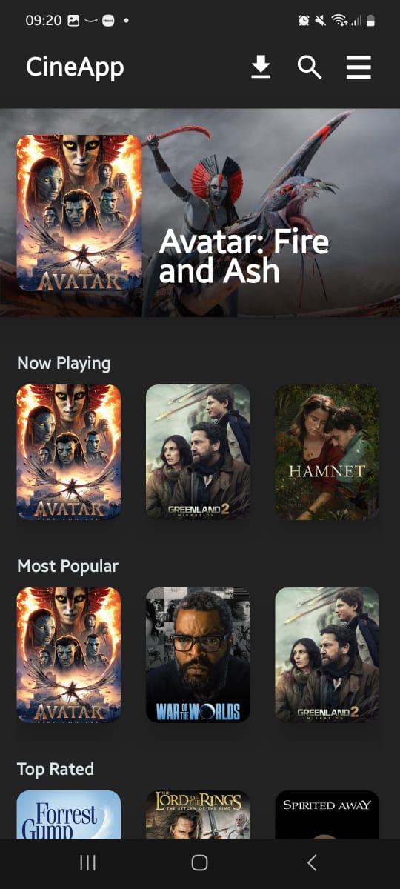

# 🎬 CineApp
O CineApp é um aplicativo Android moderno que permite aos usuários explorar o vasto catálogo do TMDB. O foco principal deste projeto foi aplicar os padrões mais recentes de desenvolvimento nativo com Jetpack Compose, priorizando performance, legibilidade de código e uma interface imersiva.

## 📸 Screenshots

   

## 🚀 Tecnologias e Habilidades
Este projeto demonstra proficiência nas seguintes áreas do ecossistema Android:
- **Jetpack Compose**: Construção de UI 100% declarativa com foco em estados e reusabilidade de componentes.
- **Clean Architecture & MVVM**: Separação clara de responsabilidades entre as camadas de Data (Retrofit/DTOs/Repository), Domain (Mappers/Models) e UI (ViewModels/States).
- **Networking com Retrofit & OkHttp**: Consumo de APIs REST com interceptores para autenticação via Bearer Token e gerenciamento de timeouts.
- **Material Design 3 (M3)**: Implementação de temas dinâmicos, uso de Tokens de cor e tipografia padronizada.
- **Gerenciamento de Imagens**: Uso da biblioteca Coil para carregamento assíncrono, cache e tratamento de estados de imagem (loading/error).

## 🛠️ Arquitetura e Injeção de Dependência
O projeto utiliza **Hilt** para Injeção de Dependência (DI), seguindo os princípios da Clean Architecture.
- **Separação de Preocupações:** Utilização de `@Module` para organizar dependências de Rede (Retrofit), Banco de Dados (Room) e Lógica de Negócio.
- **Abstração com @Binds:** As camadas de `Repository` interagem apenas com interfaces (`LocalDataSource` e `RemoteDataSource`), facilitando a manutenção e testabilidade.
- **Escopos Inteligentes:** Uso de `SingletonComponent` para instâncias globais e `ViewModelComponent` para dependências vinculadas ao ciclo de vida da UI.
- **Qualifiers Personalizados:** Implementação de `@DispatcherIO` para garantir a injeção correta de contextos de execução em Coroutines.

## 🧪 Qualidade de Código e Testes
Para garantir uma base de código sólida e livre de regressões, o projeto implementa testes unitários focados na lógica de negócio e estados da UI:
- **Turbine**: Utilizado para testar Kotlin Flows de forma concisa, garantindo que os estados do ViewModel sejam emitidos na ordem correta.
- **MockK / Mockito**: Empregado para mockar dependências de rede e respostas da API, isolando o comportamento das unidades testadas.
- **Fake Data**: Uso de Fakes (objetos de domínio reais preenchidos com dados de teste) para validar mappers e lógica de UI sem depender de dados reais da rede.
- **ViewModel Testing**: Validação de estados durante o ciclo de vida das chamadas de API.

## 🛠️ Destaques Técnicos
Otimização de Rede e Performance
- **Append to Response**: Utilização de técnicas avançadas da API TMDB para buscar múltiplos recursos (Detalhes + Elenco) em uma única requisição HTTP, reduzindo a latência e o consumo de dados do usuário.
- **Lazy Loading**: Implementação eficiente de listas com LazyColumn e LazyRow, garantindo scroll fluido mesmo em listas longas através da reciclagem de memória.

### UI/UX Avançada
- **Custom Graphics**: Criação de gradientes dinâmicos (Brush.verticalGradient) com color stops calculados para garantir legibilidade de texto sobre imagens de banner variáveis.
- **Responsive Layouts**: Adaptação de imagens utilizando ContentScale.Crop com alinhamentos estratégicos (Alignment.TopCenter) para preservar rostos e elementos principais das fotos de fundo.
- **Componentes Customizados**: Criação de Chips informativos e componentes de elenco modulares para manter a consistência visual.

